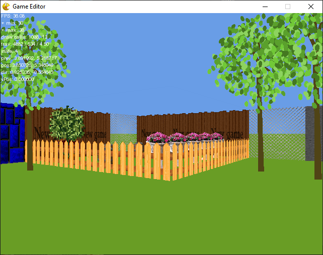

# SABRE

SABRE is a raycasting pseudo 3D engine for Game Editor. The original raycasting logic and math is adapted from the [raycasting tutorial series](https://lodev.org/cgtutor/raycasting.html) made by [Lode Vandevenne](https://lodev.org/cgtutor/index.html).

